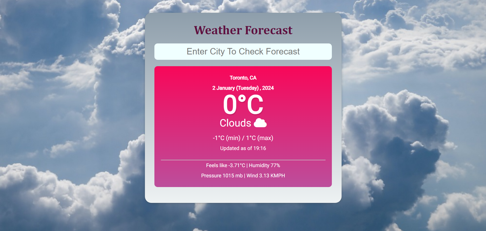

# Weather_Projection_WebApp

# Open Weather API is been used to fetch real time data

# This Project is coded in HTML,CSS,Javascript

 
# Features of the project.

* User-friendly UI
* It provides dynamic weather forecast specifically temp, min max temperature.
* Background image changes according to weather condition.
* Basic information has been provided - feels like temperature, humidity, pressure, wind speed.

# Weather Forecast Demo

* Default 

* City name correctly entered
 

* Empty field passed
 

* Incorrect City name entered
 

